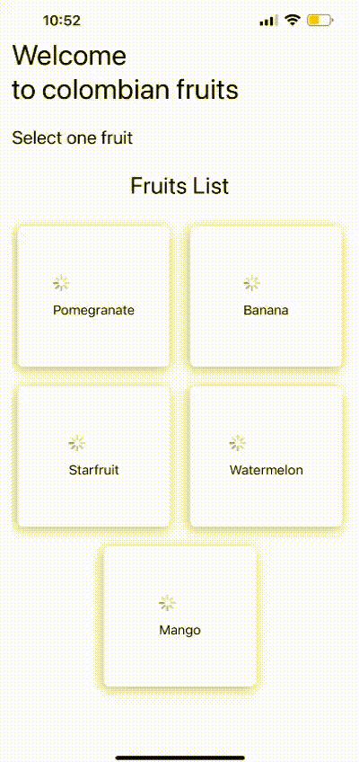

#  Colombian fruits app

## Short gif showing app functionalities

Beggining carousel:

Dashboard home (Now, it's just showing loading indicators):

## Code structure:

Uses a modular architecture

        .
        ├── Assets.xcassets
        ├── Common
        │   ├── Constants.swift
        │   └── Extensions.swift
        ├── Features
        │   ├── Home
        │   │   ├── HomeView.swift
        │   │   └── HomeViewModel.swift
        │   │   └── HomeCoordinator.swift
        │   └── Carousel
        │       ├── CarouselView.swift
        │       └── CarouselViewModel.swift
        │       └── CarouselCoordinator.swift
        ├── Models
        │   └── User.swift
        └── Utils
            └── Networking.swift
            └── Storage.swift
            

